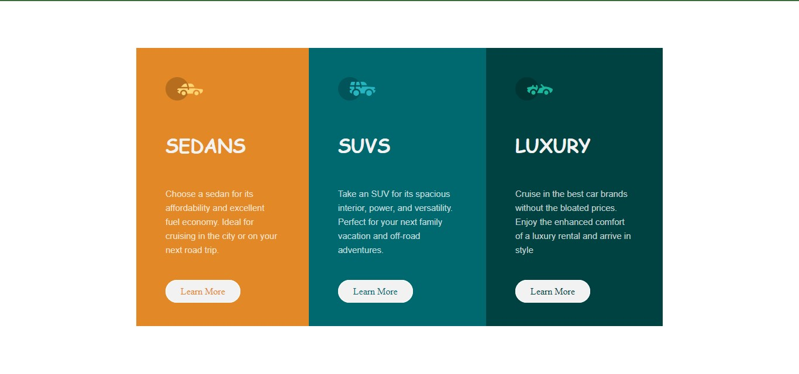

# Frontend Mentor - 3-column preview card component solution

This is a solution to the [3-column preview card component challenge on Frontend Mentor](https://www.frontendmentor.io/challenges/3column-preview-card-component-pH92eAR2-). 

## Table of contents

- [Overview](#overview)
  - [The challenge](#the-challenge)
  - [Screenshot](#screenshot)
  - [Links](#links)
- [My process](#my-process)
  - [Built with](#built-with)
  - [What I learned](#what-i-learned)
  - [Continued development](#continued-development)
  - [Useful resources](#useful-resources)
- [Author](#author)
- [Acknowledgments](#acknowledgments)


## Overview

### The challenge

Users should be able to:

- View the optimal layout depending on their device's screen size
- See hover states for interactive elements

### Screenshot




### Links

- Live Site URL: (https://meelynda.github.io/3-column-preview-card/)

## My process

### Built with

- Semantic HTML5 markup
- CSS custom properties
- Flexbox
<!-- - [Styled Components](https://styled-components.com/) - For styles -->

### What I learned

While working on this project i learnt more on using flexbox, psuedo selectors and media query.
Below are code samples of my project:

```html
<h1>Some HTML code I'm proud of</h1>
<div class="suv">
    
    <h1>SUVS</h1>
    <p>Take an SUV for its spacious interior, power, and versatility. Perfect for your next family vacation and off-road adventures.</p>
    <a class="link" href="#">Learn More</a>
</div>
```
```css
.proud-of-this-css {
  .link:hover{
    background: transparent;
    color: hsl(0, 0%, 95%);
}
}
```

### Continued development

I will be focusing more on learning media quueries and css grid next to perfect my techniques.  

### Useful resources

- [Example resource 1](https://www.w3schools.com/css) - This site helped me more in understanding css. I really liked their pattern and will use it going forward.


## Author

- Frontend Mentor - [@meelynda](https://www.frontendmentor.io/profile/yourusername)
- Twitter - [@LyndaObi](https://www.twitter.com/yourusername)


## Acknowledgments

Thanks to my tutor [@Adetutu777] (https://github.com/Adetutu777), [@Web3Bridge](https://twitter.com/Web3Bridge) community and[@BlockchainUNN](https://twitter.com/blockchainunn) community for helping me on this project.